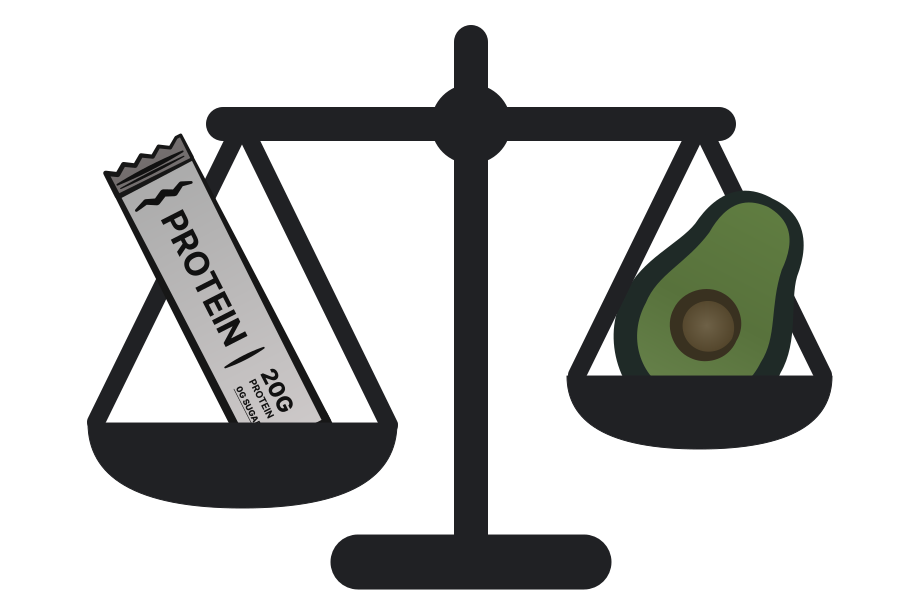

<p align="center">
  
</p>

# Food Integrity Scale (FIS)

A deterministic classification system that evaluates how processed and/or engineered a food product is, with multi-axis scoring across real-world consumer products.

Built with real data — 28,000+ products parsed across 4 U.S. retailers — and refined through 10+ iterations of the scoring system and methodology. Ingredient lists and nutritional profiles can be inconsistent, difficult to interpret, or simply misleading. FIS solves that.

The core scoring framework uses ingredient lists and nutrition panels to score products on four axes. FIS does not attempt to define what is healthy. It evaluates what ingredients are in a product, what those ingredients are and do, and how a product is constructed and engineered. A multi-dimensional system makes it possible to distinguish between products that are superficially similar but materially different.

## Motivation

NOVA is the most widely used food classification system in nutrition research. It sorts all food products into four groups. But evaluating food processing is a multi-dimensional problem, and existing single-axis systems with binary-style classification like NOVA fail to capture that complexity — products that are materially different collapse into the same group.

<p align="center">
  
</p>

### The Four Axes

| Axis | Range | What It Measures |
|------|-------|-----------------|
| **MDS** (Matrix Disruption) | 0-30 | How far ingredients have been removed from their whole-food origin — fractionated substrates, industrial intermediates, hydrogenated fats |
| **AFS** (Additive/Formulation) | 0-80 | Additive load by both severity (weighted by evidence tier) and density (count of unique additives) |
| **HES** (Hyperpalatability Engineering) | 0-20 | Extent to which ingredient-combination patterns engineer hyperpalatability — flavor + sweetener, multi-sweetener masking, fat-sweet-flavor stacking — including in products whose nutrition labels appear clean |
| **MLS** (Metabolic Load) | 0-20 | Physiological burden from nutrition panel data — added sugars, sodium, saturated fat |

Each axis captures a different dimension of processing that is not redundant with the others. MDS-AFS correlation is 0.56 after double-counting removal.

### Processing Tiers

| Tier | Score | Description |
|------|-------|-------------|
| W | 0 | Whole food (single ingredient, whole-food taxonomy) |
| Wp | 0 | Whole, prepared (ground, dried, frozen — nothing added) |
| C0 | 0 | Clean, zero concerns (multi-ingredient, no markers) |
| C1 | 1-5 | Clean, minimal markers |
| P1a | 6-15 | Light processing |
| P1b | 16-25 | Moderate-light processing |
| P2a | 26-38 | Moderate processing |
| P2b | 39-50 | Moderate-heavy processing |
| P3 | 51-75 | Heavy industrial formulation |
| P4 | 76+ | Ultra-formulated |

## System Architecture

```
Product data (name, ingredients, nutrition, serving size)
    |
    v
Ingredient normalization
    Allergen stripping, enrichment context removal,
    store-aware parsing, nesting depth analysis
    |
    v
Taxonomy classification (11 families, 64 subfamilies)
    LLM classifier (Claude Haiku) + deterministic fallback
    SHA-256 cached to disk, version-gated
    |
    v
Ontology pattern matching (174 regex patterns)
    Tier A/B/C additives, Bucket 2/3 substrates,
    HES sweetener/fat/flavor lists
    |
    v
Four-axis scoring engine
    MDS + AFS + HES + MLS = Composite (0-150)
    |
    v
Classification (10 processing tiers, 6 metabolic tiers)
```

## Dataset

**28,000+ products** from U.S. grocery retailers spanning mass-market, full-service, specialty, and curated clean-food channels. **26,000+** with complete processing classifications after excluding non-food items and products with missing ingredient data.

Designed for robustness to inconsistent ingredient lists and labeling formats across retailers.

## Interactive Demos

- **[Protein Bars](https://dmh221.github.io/food-integrity-scale/demos/protein_bars.html)** — 6 bars from C0 to P3. More protein doesn't mean more processing.
- **[Yogurt](https://dmh221.github.io/food-integrity-scale/demos/yogurt.html)** — The diet yogurt paradox: the "Light" yogurt is the most processed.
- **[Peanut Butter](https://dmh221.github.io/food-integrity-scale/demos/peanut_butter.html)** — The nut butter ladder: from raw peanuts to sugar-first spreads.
- **[Electrolytes](https://dmh221.github.io/food-integrity-scale/demos/electrolytes.html)** — The hydration spectrum: salt water to synthetic cocktail.

## Validation

- **NOVA concordance:** W/Wp maps to NOVA Group 1, C0/C1 to Groups 2/3, P1b+ to Group 4. FIS adds 7-tier discrimination within Group 4.
- **Sensitivity analysis:** 22 parameter variations tested. All preserve tier monotonicity. Most impactful: HES 2.0x scaling (25% composite change). [Full analysis](docs/fis_methodology_and_findings.md)
- **Axis independence:** MDS-AFS correlation 0.56 after double-counting removal. Each axis captures a non-redundant dimension.
- **Farm to People anchor:** 80.6% of FTP products score W/C0/C1. Zero P2b/P3/P4. Confirms the scoring floor works.

## Quick Start

```bash
python -m venv venv && source venv/bin/activate
pip install -r requirements.txt

# Run tests (no external data needed)
python -m pytest tests/ -v

# Score products
python run_scoring.py
```

Taxonomy classification requires an Anthropic API key (`ANTHROPIC_API_KEY` env var) for Claude Haiku. Use `--no-llm` to skip LLM classification.

## Project Structure

```
scoring/
    ontology.py          Ingredient ontology — 174 patterns, tiers, buckets
    scorer.py            Orchestrator — normalization, scanning, 4-axis scoring
    normalize.py         Store-aware ingredient parsing, allergen stripping
    product_taxonomy.py  LLM taxonomy classifier (11 families, 64 subfamilies)
    rules_mds.py         Matrix Disruption Score
    rules_afs.py         Additive/Formulation Score
    rules_hes.py         Hyperpalatability Engineering Score
    rules_mls.py         Metabolic Load Score
    micro_label.py       Micro-label classifier (regex + LLM, 4th taxonomy level)
analysis/                Interactive comparison generators + shared chart styles
tests/                   Ontology, scoring rules, and anchor tests (281 tests)
docs/                    Methodology paper and figures
```

## Methodology

See [docs/fis_methodology_and_findings.md](docs/fis_methodology_and_findings.md) for the full methodology paper, including validation against NOVA, sensitivity analysis, and empirical findings from 27,941 products across four U.S. grocery retailers.

## License

[MIT](LICENSE)
